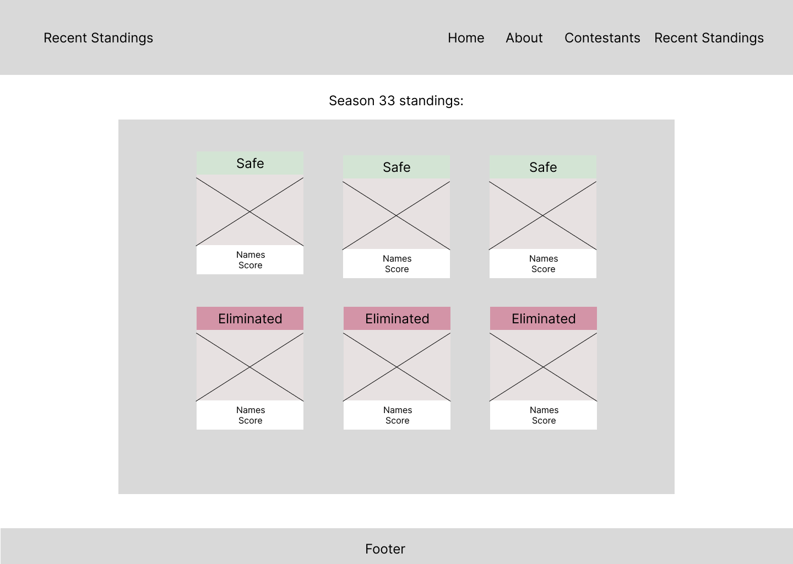
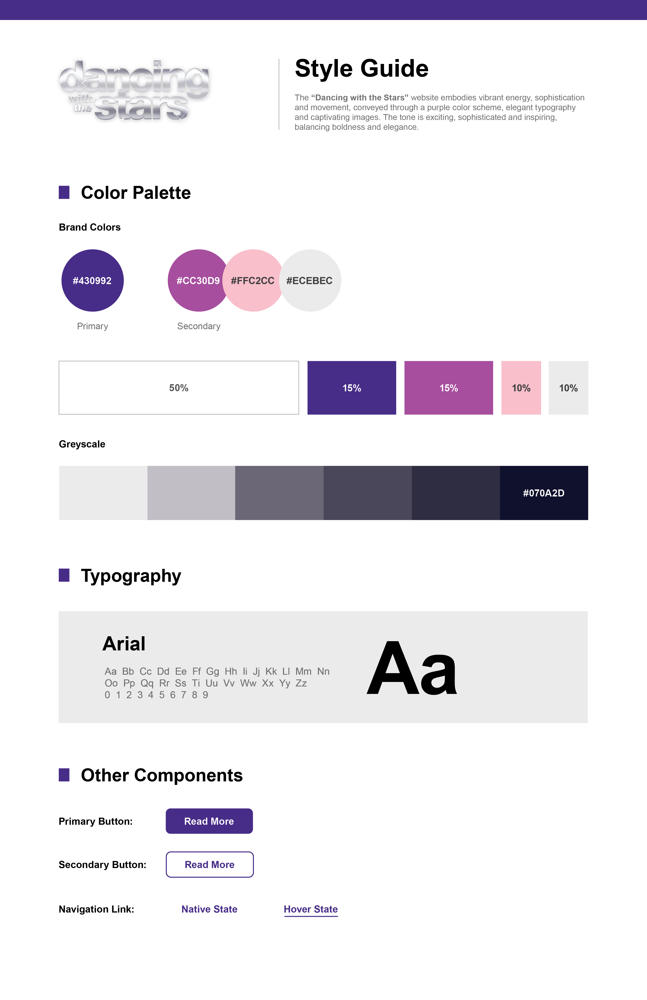

# Dancing-With-the-Stars

Dancing With the Stars is a Reality TV show.

## Wireframes

Home Page:

About Page:

Cast Page:

Recent Standings Page:

## Style Guide

## Challenges

There were no challenges that arose in this project. Any questions or confusion that arose for a group member was able to be solved by other group members helping them out. It was a true team effort and after we got used to Git Hub navigation in a group setting/collaborating it worked efficiently. 
